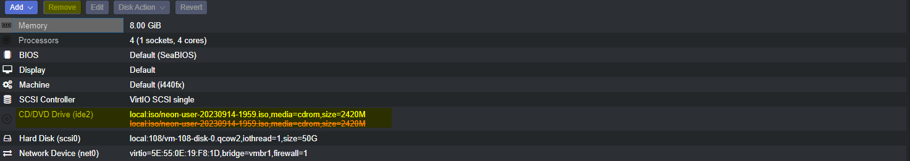
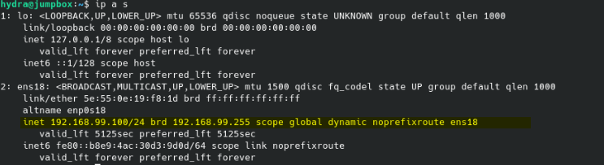
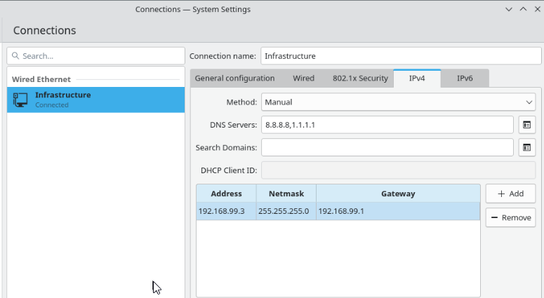

# What is a jumpbox and why do we need it? 

Imagine you have a big, secure building with lots of rooms, each containing valuable information or resources, like important documents or expensive equipment. Now, you don't want just anyone walking into these rooms because that could be risky. So, to make sure only authorized people get access, you set up a system with locked doors and security guards.

But, there's a problem. How do you let the security guards in? You can't just give them keys to all the rooms because that would be too risky. Instead, you create a small, extra-secure room right at the entrance of the building. This room has really strong locks, alarms, and security measures. It's like a super-safe waiting area.

This super-safe waiting area is what we call a "jumpbox" in the world of computer networks. It's like a gatekeeper or security checkpoint for your network. Only the people who are supposed to access the different rooms (servers or computers) in your network are allowed into this jumpbox. Once they're inside, they can then move from the jumpbox to the other rooms if they have the right permissions.

So, think of a jumpbox as a highly secure gateway that acts as the first line of defense for your network. It ensures that only authorized users can access the more sensitive parts of your network, just like a super-secure waiting room makes sure only authorized people can enter a secure building.

# OS Selection

For our OS we are going to use KDE Neon. We're just going to copy the link and install it directly from the link as opposed to downloading it to our local machine. 

# Hardware Config 

We're going to allocate this guy 8 GB of RAM, 4 cores, and about 50 GB of storage. Feel free to scale up/down as needed for your own enviroment. Once you have it set up to your liking, go ahead and launch the VM and view it through the console. Also ensure your vitrual router is running.

# Jumpbox Configuration

Once you're inside the KDE Neon enviroment, you will be met with one icon that simply says 'Install'. Fill out the information and just let the install run. Once you finish the install, you will need to restart and then remove the install media.

Once you're back up and running, you can confirm that your network is running properly by opening Konsole and running `ip a s` this will show you if you are picking up an IP address from your DHCP pool

Once we confirmed we are indeed pulling a proper IP address, we can go configure our network settings.

Keep the Konsole open and run 

`sudo systemctl restart NetworkManager` 

This will restart your network settings and bring up the one we just configured. 

I won't go over the firewall configuration, interface renaming, etc. If you would like to get into that, I would strongly suggest checking out the documentation for opnsense. Essentially we are just allowing traffic from our jumpbox to the rest of our internal network. 